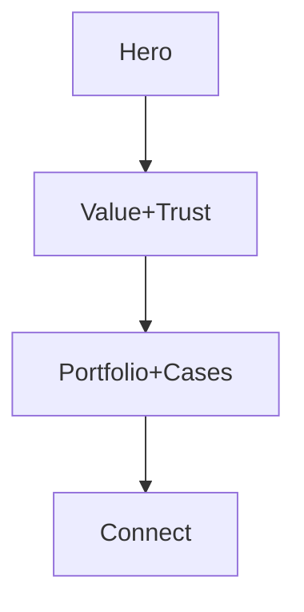

# ACP Brand Visuals

## Exec
Amber+neutrals+grid/curve→partnership. citeturn8view0turn15view0

## Color evidence
Infer (dominant pixels): Amber #FAB30D; Slate #373F4B; Charcoal #343434; neutrals #F2F1E3/#B7BABD; curved mask+faint grid. citeturn8view1turn2view1turn15view0

## System + messaging
Tone warm+confident; amber accents/CTAs. Visuals: people+line icons+neutral charts (amber highlight). A11y: amber/white=1.82 fail; slate↔amber=5.83 pass. Type: Open Sans 400/600/700 + Karmina/Serif. Pillars: shared success; speed; early invest; B2B focus; buy&build; toolkit. Copy: Hero Unlock Growth | VP Fast+Certain | Trust $1.8B+Clev/Dallas | Portfolio See investments | Contact Let’s talk citeturn1view0turn2view1

## Peers + moodboard + method
Peers: Blue Point BW; Rotunda topo; CenterGate industrial; Halifax caps+stats; Benford metrics; HCI minimal. Moodboard: amber gradient+curve/grid+serif. citeturn12view0turn12view3turn12view2turn14view0turn11view1turn11view5

Queries: site:aligncp.com ACP-Firm-Overview.pdf; Align Capital Partners LinkedIn logo banner. Rules: official-only; no 3P.