<div align="center">

# CTG Sourcing Intelligence Platform

**AI-powered prospect identification and engagement for contact center technology sourcing**

[](#)
[](#)
[](#five-autonomous-ai-agents)
[](#data-source-taxonomy--62-sources)
[](#)

**[Live Demo →](https://ctg-intel-platform.netlify.app)**

</div>

---

## Overview

Every enterprise with a contact center eventually faces a technology decision — migrate to CCaaS, deploy AI, overhaul QA, modernize workforce management. These are complex, high-stakes purchases involving 50–200+ vendors across 50+ solution categories. Most buyers navigate this alone, spending 3–12 months and $50K–$500K+ on evaluations they're unqualified to run.

**This platform identifies those buyers before they start searching**, scores their urgency using a six-factor strain model, and routes them to the right CTG Guru at the right moment — turning reactive lead generation into predictive pipeline manufacturing.

| Metric | Value |
|--------|-------|
| Scored Prospects | 30 across 7 industry verticals |
| Total Pipeline | $51.9M annual CC spend |
| Pipeline Value | $8.2M / $1.4M/yr projected commission |
| Hot Prospects | 9 representing $27.5M annual CC spend |
| End-to-End Latency | 2–6 hours (signal → scored prospect with outreach brief) |
| Detection Accuracy | 94% |
| Data Sources | 62 across 9 intelligence categories |

---

## Quick Start

The platform is a live, working application — not a slide deck.

1. Open **[ctg-intel-platform.netlify.app](https://ctg-intel-platform.netlify.app)**
2. Use the sidebar tabs to navigate between seven interactive sections
3. Click any prospect card in **Pipeline Intelligence** to see full scoring details
4. Try the **Strain Simulator** presets (Enterprise CCaaS, AI-First, Healthcare, BPO)
5. Run the agent chain in **Agent Architecture** to watch the processing sequence

---

## Technical Architecture

### Stack

| Layer | Technology | Notes |
|-------|-----------|-------|
| Frontend | Vanilla HTML / CSS / JavaScript | Zero framework dependencies |
| Architecture | Modular SPA | Hash-based routing, module `init()`/`destroy()` lifecycle |
| Design System | Obsidian | Custom dark-mode tokens in `obsidian.css` — WCAG AA compliant |
| Components | 20+ shared components | `shared-components.js` — KPI cards, tier badges, radar charts, circular scores |
| Orchestration | n8n | Workflow engine managing agent chain, credential rotation, rate limiting |
| AI Classification | Claude API | Signal type classification at 94% detection accuracy |
| Enrichment | 12 parallel APIs | ~3 seconds per prospect for full firmographic/technographic enrichment |
| Hosting | Netlify | Static deployment, zero server-side dependencies |

### Design System — Obsidian Tokens

The platform uses a purpose-built dark-mode design system. Core tokens from `css/obsidian.css`:

```
Backgrounds:  #09090B (page) → #111113 (surface) → #18181B (elevated)
Text:         #FAFAFA (19.6:1) → #A1A1AA (7.4:1) → #71717A (4.6:1) → #52525B (decorative)
Accents:      Emerald #34D399 | Red #EF4444 | Amber #F59E0B | Blue #3B82F6 | Violet #A78BFA | Teal #14B8A6
Typography:   Plus Jakarta Sans (UI) | JetBrains Mono (data)
```

Tier colors: 🔴 HOT (Red) · 🟡 WARM (Amber) · 🟢 NURTURE (Teal) · 🔵 STRATEGIC (Blue)

### SPA Module System

Each section is a self-contained module loaded lazily via `app.js`. Modules register with the global namespace and implement the `init()`/`destroy()` contract:

```javascript
// Module registry in app.js
var MODULES = {
  'command-center':     { css: 'css/command-center.css',     js: 'js/command-center.js',     accent: 'emerald' },
  'pipeline-intel':     { css: 'css/pipeline-intel.css',     js: 'js/pipeline-intel.js',     accent: 'emerald' },
  'strain-simulator':   { css: 'css/strain-simulator.css',   js: 'js/strain-simulator.js',   accent: 'emerald' },
  'revenue-model':      { css: 'css/revenue-model.css',      js: 'js/revenue-model.js',      accent: 'emerald' },
  'agent-architecture': { css: 'css/agent-architecture.css', js: 'js/agent-architecture.js', accent: 'blue'    },
  'competitive-map':    { css: 'css/competitive-map.css',    js: 'js/competitive-map.js',    accent: 'red'     },
  'build-roadmap':      { css: 'css/build-roadmap.css',      js: 'js/build-roadmap.js',      accent: 'amber'   }
};
```

Hash-based routing (`#command-center`, `#pipeline-intel`, etc.) drives navigation. CSS is injected once per module on first load. The shell manages sidebar tab activation via `Shell.activateNavTab()`.

---

## Five Autonomous AI Agents

Five agents coordinated through an n8n orchestration layer. Each has a defined mission, clear triggers, and measurable outputs. Human review gates every outreach action — this is intelligence augmentation, not sales automation.


| Agent | Role | Triggers | Output |
|-------|------|----------|--------|
| **Scout** — THE EYES | Signal detection | Job postings, RFPs, contract expirations, leadership changes, vendor EOL notices | Raw classified signals (10 types) |
| **Analyst** — THE BRAIN | Scoring & enrichment | New signals from Scout | Scored prospect profiles (0–100 Strain Index), tier crossings, enriched firmographics |
| **Strategist** — THE VOICE | Outreach generation | Tier crossings (especially → HOT) | Contextual outreach briefs, channel/timing recommendations, Guru matching |
| **Planner** — THE CALCULATOR | Revenue modeling | New scored prospects | Commission projections, conversion probability, portfolio risk assessment |
| **Monitor** — THE MEMORY | Feedback loop | Engagement outcomes | Model weight calibration, prediction accuracy tracking |

**Signal Chain:** Scout detects → Analyst scores → tier crossing detected → Strategist generates outreach brief → Guru assigned → outcome tracked → Monitor feeds back → model improves. Runs continuously.

**End-to-end latency:** 2–6 hours from raw signal (e.g., a LinkedIn job posting) to a Guru receiving a personalized engagement package with the prospect's strain profile, competitive landscape, and recommended approach angle.

---

## Sourcing Strain Index — Scoring Model

Every contact center technology buyer follows a predictable arc: pain accumulates, internal attempts fail, urgency spikes, they seek outside help. The Strain Index scores where each prospect sits on this arc.

### Six Weighted Factors

| Factor | Weight | What It Measures | Max Signal |
|--------|--------|-----------------|------------|
| Vendor Universe Size | 20 pts | Number of vendors in prospect's space | 100+ vendors = max complexity |
| Evaluation Complexity | 20 pts | Technical depth of buying decision | Multi-platform + AI + analytics |
| Timeline Pressure | 20 pts | Months until decision required | ≤3 months = max urgency |
| Internal Expertise Gap | 15 pts | Domain knowledge to evaluate options | Score 4–5 = no internal expertise |
| Compliance Burden | 15 pts | Regulatory requirements | HIPAA + PCI + SOC2 = triple layer |
| Stakeholder Complexity | 10 pts | Decision-makers involved | 7+ stakeholders = consensus paralysis |

### Composite Formula

```
Strain Index = vendorUniverse(0.20) + evalComplexity(0.20) + timelinePressure(0.20)
             + expertiseGap(0.15) + complianceBurden(0.15) + stakeholders(0.10)
```

### Tier Thresholds

| Tier | Range | Action |
|------|-------|--------|
| 🔴 **HOT** | 75–100 | Decision imminent — immediate Guru engagement |
| 🟡 **WARM** | 50–74 | Actively evaluating — active outreach |
| 🟢 **NURTURE** | 25–49 | Building relationship — content + touchpoints |
| 🔵 **STRATEGIC** | 0–24 | Long-term target — monitor and nurture |

### Hours Saved Calculation

```
Evaluation Hours Eliminated = Vendor Universe × 4.5 hours × 70% reduction
```

A prospect facing 120 vendors = ~378 hours of evaluation work CTG absorbs.

---

## Intelligence Sourcing Pipeline

The platform doesn't wait for prospects to self-identify. It monitors external data sources, detects buying signals, enriches with context, scores against the Strain Index, and routes through the agent chain.

```mermaid
flowchart TB
    subgraph INGEST["INGEST — 62 Data Sources"]
        direction LR
        API["API\n2-6 hrs"]
        RSS["RSS\n1-4 hrs"]
        SCRAPE["Scrape\n6-12 hrs"]
        WEBHOOK["Webhook\nReal-time"]
        MANUAL["Manual\nAd hoc"]
    end

    subgraph DETECT["DETECT — 10 Signal Types"]
        SIG["aiInitiative · ccaasMigration · qaCompliance\ncostReduction · wfmOverhaul · remoteAgent\ndigitalTransform · platformRfp · outsourcingEval · newCxLeader"]
    end

    subgraph ENRICH["ENRICH — 12 APIs in Parallel"]
        E1["Firmographics\nCrunchbase + LinkedIn"]
        E2["Tech Stack\nBuiltWith + Wappalyzer"]
        E3["Contract Intel\nSEC + Vendor EOLs"]
        E4["Leadership\nLinkedIn + Press"]
        E5["Compliance\nRegulatory Filings"]
        E6["Vendor Landscape\nCTG Database"]
    end

    subgraph SCORE["SCORE — Strain Index"]
        SSI["6-factor composite → 0-100\nTier thresholds trigger downstream"]
    end

    subgraph ACT["ACT — Agent Chain"]
        CHAIN["Scout → Analyst → Strategist → Planner → Guru → Monitor"]
    end

    INGEST --> DETECT
    DETECT --> ENRICH
    ENRICH --> SCORE
    SCORE --> ACT

    style INGEST fill:#111113,stroke:#34D399,color:#FAFAFA
    style DETECT fill:#111113,stroke:#3B82F6,color:#FAFAFA
    style ENRICH fill:#111113,stroke:#A78BFA,color:#FAFAFA
    style SCORE fill:#111113,stroke:#F59E0B,color:#FAFAFA
    style ACT fill:#111113,stroke:#EF4444,color:#FAFAFA
```



### 10 Signal Types Detected

| Signal Type | Count (Demo) | Description |
|-------------|-------------|-------------|
| `aiInitiative` | 17 | AI deployment or strategy announcements |
| `ccaasMigration` | 15 | Cloud contact center platform migration |
| `qaCompliance` | 12 | Quality assurance or compliance overhaul |
| `costReduction` | 8 | Cost optimization or consolidation |
| `wfmOverhaul` | 7 | Workforce management modernization |
| `remoteAgent` | 6 | Remote/hybrid agent infrastructure |
| `digitalTransform` | 6 | Broad digital transformation initiative |
| `platformRfp` | 5 | Active RFP or RFI for CC technology |
| `outsourcingEval` | 5 | BPO or outsourcing evaluation |
| `newCxLeader` | 5 | New CX/CC executive hire |

Classification via Claude API. 94% detection accuracy. 2–6 hour latency.

### Enrichment Pipeline

12 APIs running in parallel per prospect (~3 seconds total):

| Domain | Sources | Data Produced |
|--------|---------|---------------|
| Firmographics | Crunchbase + LinkedIn | Revenue, headcount, funding, industry |
| Tech Stack | BuiltWith + Wappalyzer | Current CC platform, cloud services, CRM |
| Contract Intel | SEC/EDGAR + vendor EOL databases | Contract values, expiration dates, vendor relationships |
| Leadership Map | LinkedIn + press releases | CX/CC executive names, tenure, hiring signals |
| Compliance Profile | Regulatory filings | HIPAA, PCI, SOC2 certification status |
| Vendor Landscape | CTG internal database | Competitive positioning, Guru expertise matching |

---

## Data Source Taxonomy — 62 Sources

### Ingestion Methods

| Method | Description | Cadence | Examples |
|--------|-------------|---------|----------|
| **API** | Authenticated REST/GraphQL endpoints | 2–6 hrs | LinkedIn, Crunchbase, SAM.gov |
| **RSS** | Syndicated feed monitoring | 1–4 hrs | PR Newswire, Federal Register |
| **SCRAPE** | Structured web extraction (respectful) | 6–12 hrs | State RFP portals, vendor pages |
| **WEBHOOK** | Real-time push notifications | Real-time | Guru referrals, CRM triggers |
| **MANUAL** | Analyst-curated with structured intake | Ad hoc | Industry events, analyst reports |

### Distribution by Category

| Category | Count | Primary Method | Polling Cadence | Signal Strength |
|----------|-------|----------------|-----------------|-----------------|
| Hiring & Talent | 9 | API | 2–4 hrs | Leading indicator |
| Procurement & RFP | 8 | API / Scrape | 4–6 hrs | Highest intent |
| Technographic | 8 | API | 6–12 hrs | Context layer |
| Financial & Corporate | 9 | API / RSS | 6–12 hrs | Strategic context |
| Leadership & Org | 6 | API / Scrape | 4–6 hrs | Strong predictor |
| Compliance & Regulatory | 7 | RSS / Scrape | 12–24 hrs | Urgency amplifier |
| Vendor & Market | 7 | RSS / Manual | 6–12 hrs | Trigger events |
| Intent & Behavioral | 5 | API / Scrape | 6–12 hrs | Active research |
| Internal & Network | 3 | Webhook | Real-time | Closed-loop |
| **TOTAL** | **62** | | | |

<details>
<summary><strong>1 · Hiring & Talent Signals — 9 Sources</strong></summary>

Job postings are the single strongest leading indicator of a contact center technology decision. A company hiring a "Director of Contact Center Technology" or "VP, Customer Experience Transformation" is 6–12 months from a major purchase.

| # | Source | Method | Signal Produced |
|---|--------|--------|----------------|
| 01 | LinkedIn Jobs | API | CC leadership/technology role postings; title + seniority + company mapping |
| 02 | LinkedIn Sales Navigator | API | Job change alerts for CC execs; new-hire-in-role triggers |
| 03 | Indeed | API | Broad CC role postings; volume indicates scale of hiring initiative |
| 04 | ZipRecruiter | API | SMB/mid-market CC roles often posted here before LinkedIn |
| 05 | Glassdoor | API | CC role postings + employee reviews mentioning technology frustration |
| 06 | Google Jobs API | API | Aggregated job feed; catches roles posted only on company careers pages |
| 07 | Dice | API | Technical CC roles: telephony engineers, WFM analysts, QA developers |
| 08 | Company Career Pages | SCRAPE | Direct monitoring of target account career pages for CC roles |
| 09 | LinkedIn Company Pages | API | Headcount changes in CC/CX departments; org restructuring signals |

</details>

<details>
<summary><strong>2 · Procurement & RFP Signals — 8 Sources</strong></summary>

Public-sector and large enterprise procurement processes generate visible artifacts: RFPs, RFIs, sole-source justifications, and contract awards. These represent buyers who have already committed budget and timeline — the highest-intent signal category.

| # | Source | Method | Signal Produced |
|---|--------|--------|----------------|
| 10 | SAM.gov | API | Federal CC technology solicitations; NAICS 517311/518210 filtering |
| 11 | GovWin IQ (Deltek) | API | Pre-RFP intelligence; forecast opportunities before public posting |
| 12 | BidNet Direct | API | State and local government CC/telecom procurements |
| 13 | State Procurement Portals | SCRAPE | Individual state purchasing sites (50 states aggregated) |
| 14 | PublicPurchase.com | SCRAPE | Municipal and county-level CC technology bids |
| 15 | NASPO ValuePoint | SCRAPE | Cooperative purchasing contracts that indicate multi-state CC buys |
| 16 | GovSpend | API | Historical government CC technology purchase orders and spend data |
| 17 | Healthcare GPO Portals | SCRAPE | Group purchasing organization CC/telecom contract vehicles |

</details>

<details>
<summary><strong>3 · Technographic Intelligence — 8 Sources</strong></summary>

Knowing what CC platform a prospect currently runs is essential for scoring. A company on Avaya on-prem faces different strain than one already on Genesys Cloud.

| # | Source | Method | Signal Produced |
|---|--------|--------|----------------|
| 18 | BuiltWith | API | Web-detectable CC technology (chat widgets, telephony JS, analytics tags) |
| 19 | Wappalyzer | API | Technology stack fingerprinting; CRM, cloud, and CC platform detection |
| 20 | HG Insights | API | Installed technology intelligence; CC platform + contract value estimates |
| 21 | Datanyze (ZoomInfo) | API | Technographic + firmographic combined; technology change alerts |
| 22 | SimilarTech | API | Technology adoption/removal tracking; competitor stack monitoring |
| 23 | 6sense (Slintel) | API | Buyer intent data overlaid on technographics; purchase timeline scoring |
| 24 | DNS / CNAME Records | SCRAPE | SIP trunk, SBC, and CCaaS provider detection via DNS lookups |
| 25 | Cloud Marketplace | SCRAPE | AWS/Azure/GCP marketplace listings for CC platform subscriptions |

</details>

<details>
<summary><strong>4 · Financial & Corporate Signals — 9 Sources</strong></summary>

Public financial disclosures reveal technology spend, vendor relationships, strategic initiatives, and operational pain. Earnings calls frequently reference "customer experience transformation" quarters before an RFP appears.

| # | Source | Method | Signal Produced |
|---|--------|--------|----------------|
| 26 | SEC EDGAR (10-K/10-Q) | API | Annual/quarterly filings mentioning CC spend, vendor contracts, technology risk |
| 27 | SEC EDGAR (8-K) | API | Material events: M&A, restructuring, leadership changes affecting CC ops |
| 28 | EDGAR Full-Text Search | API | Keyword monitoring across all filing types for CC technology terms |
| 29 | Earnings Call Transcripts | API | NLP extraction of CX/CC initiative mentions from quarterly calls |
| 30 | Crunchbase | API | Firmographics: revenue, headcount, funding rounds, industry classification |
| 31 | PitchBook | API | PE/VC portfolio companies; M&A activity triggering CC platform consolidation |
| 32 | D&B / Hoovers | API | Company hierarchies, subsidiary mapping, credit risk indicators |
| 33 | PR Newswire / BusinessWire | RSS | Press releases: partnerships, expansions, transformation announcements |
| 34 | S&P Capital IQ | API | Financial benchmarking; peer comparison for CC technology spend ratios |

</details>

<details>
<summary><strong>5 · Leadership & Organizational Signals — 6 Sources</strong></summary>

New CX/CC leadership is the second-strongest buying predictor after RFP filings. A new VP of Customer Experience typically initiates a technology review within 90 days of start date.

| # | Source | Method | Signal Produced |
|---|--------|--------|----------------|
| 35 | LinkedIn People Changes | API | CXO/VP/Director role changes in CC/CX functions at target accounts |
| 36 | BoardEx / Equilar | API | Board-level appointments signaling strategic CX priority shifts |
| 37 | Press Release Monitoring | RSS | Executive appointment announcements with CX/CC mandate language |
| 38 | Executive Social Media | SCRAPE | LinkedIn posts/articles from new CC leaders signaling priorities |
| 39 | Conference Speaker Lists | SCRAPE | CC/CX execs speaking at Enterprise Connect, CCW, ICMI, etc. |
| 40 | Organizational Charts | SCRAPE | Publicly available org changes indicating CC function restructuring |

</details>

<details>
<summary><strong>6 · Compliance & Regulatory Signals — 7 Sources</strong></summary>

Regulatory changes force technology decisions. A new HIPAA enforcement action, PCI DSS 4.0 deadline, or state-level call recording law creates non-discretionary buying urgency.

| # | Source | Method | Signal Produced |
|---|--------|--------|----------------|
| 41 | Federal Register | RSS | New/proposed rules affecting CC operations (telecom, recording, AI) |
| 42 | HHS / OCR Bulletins | RSS | HIPAA enforcement actions and guidance updates for healthcare CC ops |
| 43 | PCI Security Standards | RSS | PCI DSS version updates, compliance deadlines, assessment guidance |
| 44 | FCC Regulatory Filings | API | TCPA updates, robocall rules, telecommunications compliance changes |
| 45 | CFPB Regulatory Updates | RSS | Consumer financial protection rules affecting FSI contact centers |
| 46 | State AG Consumer Offices | SCRAPE | State-level call recording, consent, and privacy law changes |
| 47 | SOC 2 / ISO Registries | SCRAPE | Compliance certification expirations and audit cycle monitoring |

</details>

<details>
<summary><strong>7 · Vendor & Market Intelligence — 7 Sources</strong></summary>

Vendor-side events create involuntary buying triggers. An EOL announcement, acquisition, or pricing change forces existing customers into evaluation mode.

| # | Source | Method | Signal Produced |
|---|--------|--------|----------------|
| 48 | Vendor EOL/EOS Notices | RSS | End-of-life announcements from Avaya, Cisco, Mitel, Genesys, NICE, etc. |
| 49 | Vendor Press Releases | RSS | Acquisitions, product sunsets, pricing changes affecting installed base |
| 50 | Gartner (MQ/Peer Insights) | MANUAL | Magic Quadrant shifts; Peer Insights reviews indicating vendor dissatisfaction |
| 51 | Forrester Wave / TEI | MANUAL | Wave repositioning and Total Economic Impact studies triggering re-evaluation |
| 52 | G2 / TrustRadius Reviews | API | Negative review trends by company; "switching from" mention monitoring |
| 53 | Vendor Partner Directories | SCRAPE | Partner program changes, delistings, tier changes affecting channel |
| 54 | Product Release Notes | RSS | Major version releases requiring upgrade decisions from installed base |

</details>

<details>
<summary><strong>8 · Intent & Behavioral Signals — 5 Sources</strong></summary>

Behavioral intent data captures what prospects are actively researching. When a target account's employees are consuming CCaaS comparison content, the evaluation process has already started — even if no RFP exists yet.

| # | Source | Method | Signal Produced |
|---|--------|--------|----------------|
| 55 | Conference Registrations | SCRAPE | Enterprise Connect, CCW, ICMI, Genesys Xperience attendance |
| 56 | Vendor Webinar Attendance | WEBHOOK | Registrations for CC vendor-hosted evaluation webinars |
| 57 | TechTarget / Aberdeen | API | Content syndication signals: CC technology whitepaper downloads |
| 58 | Google Alerts | RSS | Prospect company mentions alongside CC technology keywords |
| 59 | Bombora Intent Data | API | Topic-level surge scoring for CC/CX technology research by company |

</details>

<details>
<summary><strong>9 · Internal & Network Signals — 3 Sources</strong></summary>

The Guru network itself is a signal source. Referrals, historical engagements, and CRM activity data feed back into the scoring model, creating a closed-loop intelligence system.

| # | Source | Method | Signal Produced |
|---|--------|--------|----------------|
| 60 | Guru Network Referrals | WEBHOOK | Direct referrals from ~90 specialists with prospect context |
| 61 | CTG CRM Activity | API | Historical engagement data: past proposals, conversations, win/loss |
| 62 | Partner / Vendor Referrals | WEBHOOK | Inbound referrals from CC vendors seeking Guru matching |

</details>

### Architecture Note

All 62 sources feed through a unified n8n orchestration layer that handles credential management, rate limiting, deduplication, and error recovery. The architecture is source-agnostic — adding new sources requires only a new n8n connector node and a signal-type mapping. No changes to scoring, enrichment, or agent logic.

---

## Seven Interactive Sections

| # | Section | Purpose | Key Interactions |
|---|---------|---------|-----------------|
| 01 | **Command Center** | Real-time operational dashboard | Filter by tier (HOT/WARM/NURTURE/STRATEGIC), watch live Intelligence Feed |
| 02 | **Pipeline Intelligence** | Prospect database with full detail panels | Click any prospect card → radar chart, signal history, strain factors, Guru match |
| 03 | **Strain Simulator** | Interactive scoring model | 6 sliders + 4 presets (Enterprise CCaaS, AI-First, Healthcare, BPO) |
| 04 | **Revenue Model** | Adjustable deal economics | Drag sliders → annual commission, Guru payout (80/20), 3-year perpetual projections |
| 05 | **Agent Architecture** | Visual agent system map | "Run Agent Chain" simulation with color-coded processing sequence |
| 06 | **Competitive Map** | Market displacement analysis | 4 competitor categories with CTG counter-positioning |
| 07 | **Build Roadmap** | Implementation plan | 4 phases with task breakdowns, investment requirements, ROI projections |

---

## Competitive Positioning

CTG displaces four alternatives — all of which it outperforms on specialization, speed, cost, and coverage:

| Alternative | Market Share | Their Weakness | CTG's Counter |
|-------------|-------------|---------------|---------------|
| DIY / Direct Buying | 55% | 200+ vendors, no leverage, 3–6 months of VP time | $0 cost, 200+ vendors evaluated, 2-week shortlist |
| Enterprise Consultancies | 15% | $200K+ engagements, generalist teams | Specialist Gurus with 20+ years CC experience |
| Other TSDs / Channel | 20% | 20–40 vendor portfolios, not CC-specialized | 50+ categories, 90 CC-focused specialists |
| BPO Advisory Firms | 10% | Narrow scope, often vendor-biased | Vendor-neutral, full-stack CC coverage |

### Revenue Model

```
Commission = Avg Seats per Deal × License Cost per Seat × 12 months × Commission Rate
Guru receives 80% | CTG retains 20% | Revenue compounds — Year 1 deals pay in perpetuity
```

From the live demo: 9 hot prospects represent $27.5M in annual CC spend. At 15% commission rate = **$4.1M/yr addressable commission** on the hot tier alone.

---

## Prospect Database

30 real-profile prospects spanning 7 industry verticals:

| Vertical | Example Prospect | Platform Distribution |
|----------|-----------------|----------------------|
| Healthcare | Meridian Health Systems, Summit Healthcare | Genesys Cloud (8) |
| Financial Services | Pinnacle Financial Group | NICE CXone (6) |
| Insurance | National Auto Insurance | Cisco UCCE (5) |
| Utilities | — | Avaya (4) |
| Travel | — | Five9 (3) |
| Technology | — | Amazon Connect (2) |
| Government | — | Other (2) |

**Tier Distribution:** 9 HOT · 13 WARM · 5 NURTURE · 3 STRATEGIC

Each prospect includes: complete firmographics, strain score with factor breakdown, signal history, radar chart visualization, CX leader identification, contact path, contract expiry, agent count, service alignment, and recommended Guru assignment.

---

## Project Structure

```
ctg-intel-platform/
├── index.html                  # SPA shell — sidebar nav + content panels
├── netlify.toml                # Netlify deployment config
├── README.md
│
├── css/
│   ├── obsidian.css            # Design system tokens (colors, typography, spacing)
│   ├── shell.css               # Layout: sidebar, content areas, responsive grid
│   ├── components.css          # Shared component styles (KPI cards, badges, charts)
│   ├── command-center.css      # Section 01 styles
│   ├── pipeline-intel.css      # Section 02 styles
│   ├── strain-simulator.css    # Section 03 styles
│   ├── revenue-model.css       # Section 04 styles
│   ├── agent-architecture.css  # Section 05 styles
│   ├── competitive-map.css     # Section 06 styles
│   └── build-roadmap.css       # Section 07 styles
│
└── js/
    ├── app.js                  # Module registry, lazy loading, hash routing
    ├── shell.js                # Sidebar navigation management
    ├── data.js                 # Prospect database (30 records), platform constants
    ├── shared-components.js    # KPI cards, tier badges, radar charts, circular scores
    ├── command-center.js       # Section 01 module
    ├── pipeline-intel.js       # Section 02 module
    ├── strain-simulator.js     # Section 03 module
    ├── revenue-model.js        # Section 04 module
    ├── agent-architecture.js   # Section 05 module
    ├── competitive-map.js      # Section 06 module
    └── build-roadmap.js        # Section 07 module
```

---

## Deployment

No build step. No bundler. No transpiler. Zero dependencies.

```bash
# Local development
open index.html
# or
npx serve .

# Netlify deployment
# Push to connected Git repo — Netlify auto-deploys from main branch
# Or manual deploy via Netlify CLI:
netlify deploy --prod --dir=.
```

---

## Architecture Principles

1. **Zero-dependency frontend** — Vanilla JS eliminates build tooling, version conflicts, and framework churn
2. **Module lifecycle contract** — Every section implements `init()`/`destroy()` for clean memory management
3. **Source-agnostic ingestion** — New data sources require only an n8n connector node and signal-type mapping
4. **Human-in-the-loop** — Every outreach action passes through a human review gate
5. **Closed-loop intelligence** — Monitor agent feeds outcomes back to calibrate scoring weights
6. **Perpetual revenue architecture** — Year 1 deals compound; commission pays in perpetuity

---

<div align="center">

**Pete Connor** · Director, Technical Center Operations

Working Prototype · February 2026

[Live Demo →](https://ctg-intel-platform.netlify.app)

</div>
